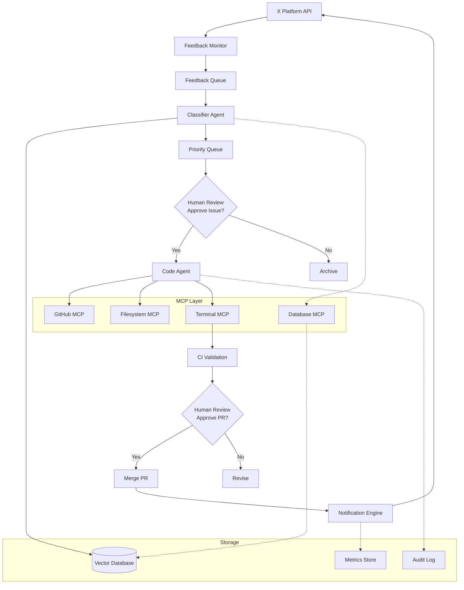

# Design Document: Ford - Feedback-to-Code Autonomous AI Agent

## Overview

Vector is a multi-agent AI system that automates the feedback-to-code pipeline by monitoring X (Twitter) for user feedback, classifying and prioritizing it, generating code changes with tests, and creating pull requests for human review. The system leverages the Model Context Protocol (MCP) to safely interact with GitHub, the filesystem, terminal commands, and a vector database.

The architecture follows a pipeline pattern with distinct stages: Ingestion → Classification → Prioritization → Implementation → Validation → Notification. Each stage is handled by specialized agents or components, with human approval gates at critical decision points.

## Architecture

### System Architecture



### Component Architecture

The system consists of the following major components:

1. **Feedback Monitor**: Polls X API, filters spam, queues feedback items
2. **Classifier Agent**: LLM-based agent that categorizes, scores, and clusters feedback
3. **Code Agent**: LLM-based agent that generates tests and code changes
4. **MCP Orchestrator**: Manages connections to MCP servers and handles retries
5. **Validation Engine**: Executes linting, tests, and builds via Terminal MCP
6. **Notification Engine**: Posts responses to X when issues are resolved
7. **Audit Logger**: Immutable log of all system actions
8. **Metrics Collector**: Tracks KPIs and system performance

### Data Flow

1. Feedback Monitor retrieves posts/replies from X API every 5 minutes
2. Raw feedback is filtered for spam and queued
3. Classifier Agent processes queue, generates embeddings, assigns categories/scores
4. Similar feedback items are clustered using vector similarity
5. High-priority clusters are presented to human reviewer for issue creation approval
6. Approved clusters trigger Code Agent to generate tests and implementation
7. Code changes are validated through CI pipeline
8. Successful changes are presented to human reviewer for PR approval
9. Merged PRs trigger notifications to original feedback authors

## Components and Interfaces

### Feedback Monitor

**Responsibilities:**
- Poll X API for new posts/replies
- Filter spam and noise
- Enqueue valid feedback items

**Interface:**
```typescript
interface FeedbackMonitor {
  // Start monitoring with configuration
  start(config: MonitorConfig): Promise<void>
  
  // Stop monitoring gracefully
  stop(): Promise<void>
  
  // Get current monitoring status
  getStatus(): MonitorStatus
}

interface MonitorConfig {
  accounts: string[]           // X accounts to monitor
  hashtags: string[]           // Hashtags to track
  pollIntervalMs: number       // Polling frequency
  lookbackHours: number        // How far back to look
  spamFilters: SpamFilter[]    // Spam detection rules
}

interface FeedbackItem {
  id: string
  author: string
  text: string
  timestamp: Date
  engagementMetrics: {
    likes: number
    retweets: number
    replies: number
  }
  metadata: {
    postUrl: string
    inReplyTo?: string
  }
}
```

**Spam Detection:**
- URL pattern matching (promotional links)
- Duplicate content detection (exact and fuzzy)
- Bot pattern recognition (rapid posting, generic text)
- Engagement ratio analysis (low engagement relative to follower count)

### Classifier Agent

**Responsibilities:**
- Categorize feedback (bug, feature_request, discussion)
- Calculate severity scores
- Generate semantic embeddings
- Cluster similar feedback
- Create structured issue summaries

**Interface:**
```typescript
interface ClassifierAgent {
  // Classify a single feedback item
  classify(item: FeedbackItem): Promise<Classification>
  
  // Find similar feedback using embeddings
  findSimilar(item: FeedbackItem, threshold: number): Promise<FeedbackItem[]>
  
  // Cluster a batch of feedback items
  cluster(items: FeedbackItem[]): Promise<FeedbackCluster[]>
  
  // Generate issue summary from cluster
  summarize(cluster: FeedbackCluster): Promise<IssueSummary>
}

interface Classification {
  category: 'bug' | 'feature_request' | 'discussion'
  severityScore: number        // 0-100
  confidence: number           // 0-1
  reasoning: string            // Explanation of classification
  embedding: number[]          // Semantic vector (1536 dimensions)
  extractedInfo: {
    affectedFeature?: string
    errorMessage?: string
    expectedBehavior?: string
    actualBehavior?: string
  }
}

interface FeedbackCluster {
  id: string
  items: FeedbackItem[]
  category: 'bug' | 'feature_request' | 'discussion'
  averageSeverity: number
  commonTheme: string
  representativeItem: FeedbackItem
}

interface IssueSummary {
  title: string
  description: string          // Markdown formatted
  category: string
  severity: number
  affectedUsers: number
  supportingEvidence: string[] // URLs to original feedback
  suggestedPriority: 'low' | 'medium' | 'high' | 'critical'
}
```

**Severity Scoring Algorithm:**
```
severityScore = (
  engagementWeight * normalizedEngagement +
  contentWeight * contentSeverityScore +
  recencyWeight * recencyScore +
  clusterWeight * clusterSizeScore
)

where:
- engagementWeight = 0.3
- contentWeight = 0.4
- recencyWeight = 0.2
- clusterWeight = 0.1

normalizedEngagement = (likes + 2*retweets + 0.5*replies) / maxObserved
contentSeverityScore = LLM-based analysis (0-100)
recencyScore = exponential decay from current time
clusterSizeScore = log(clusterSize) / log(maxClusterSize)
```

### Code Agent

**Responsibilities:**
- Generate test cases from issue descriptions
- Implement code changes to fix bugs or add features
- Ensure code style consistency
- Provide reasoning for all changes

**Interface:**
```typescript
interface CodeAgent {
  // Generate tests for an issue
  generateTests(issue: IssueSummary, context: CodeContext): Promise<TestGeneration>
  
  // Implement code changes
  implementFix(issue: IssueSummary, tests: TestGeneration, context: CodeContext): Promise<CodeChanges>
  
  // Validate changes against constraints
  validateChanges(changes: CodeChanges): Promise<ValidationResult>
}

interface CodeContext {
  repositoryPath: string
  relevantFiles: string[]      // Files identified as relevant
  codeStyle: CodeStyleGuide
  testFramework: string        // e.g., "jest", "vitest", "mocha"
  allowedDirectories: string[] // Directories agent can modify
}

interface TestGeneration {
  testFiles: FileChange[]
  testCases: TestCase[]
  reasoning: string
}

interface TestCase {
  name: string
  description: string
  expectedBehavior: string
  testCode: string
}

interface CodeChanges {
  branch: string
  files: FileChange[]
  reasoning: ChangeReasoning
  estimatedImpact: ImpactAnalysis
}

interface FileChange {
  path: string
  operation: 'create' | 'modify' | 'delete'
  content?: string
  diff?: string
}

interface ChangeReasoning {
  summary: string
  perFileReasoning: Map<string, string>
  tradeoffs: string[]
  alternativesConsidered: string[]
}

interface ImpactAnalysis {
  filesModified: number
  linesAdded: number
  linesDeleted: number
  affectedComponents: string[]
  riskLevel: 'low' | 'medium' | 'high'
}
```

**Code Generation Strategy:**
1. Use Filesystem MCP to read relevant source files
2. Analyze code structure and identify modification points
3. Generate failing tests that reproduce the issue
4. Implement minimal changes to make tests pass
5. Preserve existing code style and patterns
6. Add comments explaining non-obvious changes

### MCP Orchestrator

**Responsibilities:**
- Manage connections to MCP servers
- Handle retries and timeouts
- Enforce security policies
- Log all MCP operations

**Interface:**
```typescript
interface MCPOrchestrator {
  // Initialize connections to MCP servers
  initialize(config: MCPConfig): Promise<void>
  
  // Execute GitHub operations
  github: GitHubMCP
  
  // Execute filesystem operations
  filesystem: FilesystemMCP
  
  // Execute terminal operations
  terminal: TerminalMCP
  
  // Execute database operations
  database: DatabaseMCP
  
  // Get health status of all MCP servers
  getHealth(): Promise<MCPHealth>
}

interface GitHubMCP {
  createIssue(repo: string, issue: IssueData): Promise<Issue>
  createBranch(repo: string, branch: string, from: string): Promise<Branch>
  createPullRequest(repo: string, pr: PRData): Promise<PullRequest>
  assignReviewer(repo: string, prNumber: number, reviewer: string): Promise<void>
  mergePullRequest(repo: string, prNumber: number): Promise<void>
}

interface FilesystemMCP {
  readFile(path: string): Promise<string>
  writeFile(path: string, content: string): Promise<void>
  listDirectory(path: string): Promise<string[]>
  fileExists(path: string): Promise<boolean>
}

interface TerminalMCP {
  execute(command: string, args: string[], options: ExecOptions): Promise<ExecResult>
  isCommandAllowed(command: string): boolean
}

interface DatabaseMCP {
  storeEmbedding(id: string, embedding: number[], metadata: any): Promise<void>
  searchSimilar(embedding: number[], limit: number, threshold: number): Promise<SearchResult[]>
  getById(id: string): Promise<StoredItem | null>
}

interface ExecOptions {
  cwd: string
  timeout: number
  env?: Record<string, string>
}

interface ExecResult {
  stdout: string
  stderr: string
  exitCode: number
  duration: number
}
```

**Security Policies:**
- Filesystem: Only read/write within configured project directories
- Terminal: Only execute whitelisted commands (npm, git, eslint, jest, etc.)
- GitHub: Rate limiting and operation logging
- Database: Query timeout enforcement

**Retry Strategy:**
- Exponential backoff: 1s, 2s, 4s
- Maximum 3 retries per operation
- Different retry policies for different error types (rate limit vs. network error)

### Validation Engine

**Responsibilities:**
- Execute linting tools
- Run test suites
- Execute build process
- Collect and report results

**Interface:**
```typescript
interface ValidationEngine {
  // Run all validation steps
  validate(changes: CodeChanges, context: CodeContext): Promise<ValidationReport>
  
  // Run individual validation steps
  lint(files: string[]): Promise<LintResult>
  test(testPattern?: string): Promise<TestResult>
  build(): Promise<BuildResult>
}

interface ValidationReport {
  success: boolean
  lint: LintResult
  test: TestResult
  build: BuildResult
  duration: number
  timestamp: Date
}

interface LintResult {
  success: boolean
  errors: LintError[]
  warnings: LintWarning[]
  filesChecked: number
}

interface TestResult {
  success: boolean
  passed: number
  failed: number
  skipped: number
  duration: number
  failures: TestFailure[]
  coverage?: CoverageReport
}

interface BuildResult {
  success: boolean
  errors: BuildError[]
  warnings: BuildWarning[]
  artifacts: string[]
}
```

**Validation Pipeline:**
1. Lint: Run ESLint/Prettier on modified files
2. Test: Run full test suite with coverage
3. Build: Execute production build
4. Each step must pass before proceeding to next
5. Collect detailed logs for all steps

### Notification Engine

**Responsibilities:**
- Post replies to X when issues are resolved
- Track notification history
- Handle rate limits
- Respect user opt-out preferences

**Interface:**
```typescript
interface NotificationEngine {
  // Notify users about resolved feedback
  notifyResolution(cluster: FeedbackCluster, pr: PullRequest): Promise<NotificationResult>
  
  // Check if user has opted out
  isOptedOut(username: string): Promise<boolean>
  
  // Record opt-out preference
  recordOptOut(username: string): Promise<void>
}

interface NotificationResult {
  sent: number
  failed: number
  skipped: number
  details: NotificationDetail[]
}

interface NotificationDetail {
  feedbackId: string
  username: string
  status: 'sent' | 'failed' | 'skipped'
  reason?: string
  postUrl?: string
}
```

**Notification Template:**
```
Thanks for the feedback! We've addressed this in [PR #123](link). 
The fix will be available in the next release. 🚀
```

## Data Models

### Database Schema

**Feedback Table:**
```typescript
interface FeedbackRecord {
  id: string                   // Primary key
  externalId: string           // X post ID
  author: string
  text: string
  timestamp: Date
  category: string
  severityScore: number
  embedding: number[]          // Vector column
  clusterId?: string           // Foreign key to clusters
  processed: boolean
  createdAt: Date
  updatedAt: Date
}
```

**Cluster Table:**
```typescript
interface ClusterRecord {
  id: string                   // Primary key
  category: string
  averageSeverity: number
  itemCount: number
  commonTheme: string
  issueId?: string             // GitHub issue number
  status: 'pending' | 'approved' | 'rejected' | 'implemented'
  createdAt: Date
  updatedAt: Date
}
```

**Change Request Table:**
```typescript
interface ChangeRequestRecord {
  id: string                   // Primary key
  clusterId: string            // Foreign key
  branch: string
  prNumber?: number
  status: 'generating' | 'validating' | 'pending_review' | 'approved' | 'rejected' | 'merged'
  reasoning: string
  impactAnalysis: string       // JSON
  validationReport?: string    // JSON
  reviewerId?: string
  reviewNotes?: string
  createdAt: Date
  updatedAt: Date
}
```

**Notification Table:**
```typescript
interface NotificationRecord {
  id: string                   // Primary key
  feedbackId: string           // Foreign key
  prNumber: number
  status: 'sent' | 'failed' | 'skipped'
  sentAt?: Date
  errorMessage?: string
  createdAt: Date
}
```

**Audit Log Table:**
```typescript
interface AuditLogRecord {
  id: string                   // Primary key
  timestamp: Date
  actor: string                // 'system' or user ID
  action: string               // e.g., 'create_issue', 'approve_pr'
  resourceType: string         // e.g., 'feedback', 'pr'
  resourceId: string
  details: string              // JSON
  signature: string            // Cryptographic signature
}
```

### Configuration Schema

```typescript
interface FordConfig {
  // X API Configuration
  xApi: {
    apiKey: string
    apiSecret: string
    accessToken: string
    accessSecret: string
  }
  
  // GitHub Configuration
  github: {
    token: string
    repository: string         // format: "owner/repo"
    defaultReviewer: string
  }
  
  // AI Model Configuration
  ai: {
    classificationModel: string // e.g., "gpt-4"
    codeModel: string          // e.g., "claude-3.5-sonnet"
    embeddingModel: string     // e.g., "text-embedding-3-large"
    temperature: number
    maxTokens: number
  }
  
  // MCP Configuration
  mcp: {
    githubServer: string
    filesystemServer: string
    terminalServer: string
    databaseServer: string
  }
  
  // Monitoring Configuration
  monitoring: {
    accounts: string[]
    hashtags: string[]
    pollIntervalMs: number
    lookbackHours: number
  }
  
  // Code Modification Rules
  codeRules: {
    allowedDirectories: string[]
    excludedPatterns: string[]
    maxLinesDeleted: number
    testFramework: string
    lintCommand: string
    testCommand: string
    buildCommand: string
  }
  
  // Notification Configuration
  notifications: {
    enabled: boolean
    template: string
  }
  
  // System Configuration
  system: {
    maxConcurrentChanges: number
    validationTimeout: number
    retryAttempts: number
  }
}
```

## Correctness Properties

*A property is a characteristic or behavior that should hold true across all valid executions of a system—essentially, a formal statement about what the system should do. Properties serve as the bridge between human-readable specifications and machine-verifiable correctness guarantees.*


### Property Reflection

After analyzing all 75 acceptance criteria, I identified several areas of redundancy:

**Redundancies Identified:**
1. Properties 3.2 and 8.2 both verify required fields are present (issue labels vs. change request fields) - can be combined into general "required fields" properties
2. Properties 6.1, 6.2, 6.3 describe a sequential validation pipeline - can be combined into one property about pipeline ordering
3. Properties 8.3 and 8.4 both describe workflow state transitions - can be combined into one state machine property
4. Properties 9.1, 9.2, 9.3, 9.4 all verify explanations are provided - can be combined into one property about explainability
5. Properties 10.2 and 10.3 both verify notification behavior - can be combined
6. Properties 14.1, 14.2, 14.3 all verify metrics tracking - can be combined into one comprehensive metrics property

**Properties to Keep:**
- Unique security properties (11.1-11.5)
- Unique workflow properties (test-first, approval gates)
- Unique data integrity properties (embeddings, clustering)
- Unique error handling properties (retries, recovery)

After reflection, I've reduced 75 criteria to 45 unique, non-redundant properties.

### Correctness Properties

Property 1: Feedback extraction completeness
*For any* feedback item retrieved from X API, the extracted data must include text content, author information, timestamp, and all engagement metrics (likes, retweets, replies)
**Validates: Requirements 1.3**

Property 2: Spam filtering accuracy
*For any* feedback item containing spam indicators (promotional links, repeated content, bot patterns), the system must filter it from further processing
**Validates: Requirements 1.4**

Property 3: Rate limit compliance
*For any* sequence of X API requests, the system must throttle requests to stay within configured rate limits
**Validates: Requirements 1.5**

Property 4: Single category assignment
*For any* processed feedback item, the classifier must assign exactly one category from {bug, feature_request, discussion}
**Validates: Requirements 2.1**

Property 5: Severity score bounds
*For any* calculated severity score, the value must be between 0 and 100 inclusive
**Validates: Requirements 2.2**

Property 6: Feedback clustering consistency
*For any* set of feedback items discussing the same topic (cosine similarity > 0.8), the system must group them into a single cluster
**Validates: Requirements 2.3**

Property 7: Issue summary completeness
*For any* generated issue summary, it must contain all required fields: problem statement, affected functionality, user impact, and supporting evidence
**Validates: Requirements 2.4**

Property 8: Ambiguity flagging
*For any* feedback item with classification confidence < 0.6, the system must flag it for human review rather than auto-classifying
**Validates: Requirements 2.5**

Property 9: Branch naming convention
*For any* created git branch for an approved issue, the branch name must match the pattern "Ford/issue-{number}-{slug}"
**Validates: Requirements 3.3**

Property 10: Pull request linkage
*For any* created pull request, it must contain a reference to the original issue ticket in the description
**Validates: Requirements 3.4**

Property 11: File access restrictions
*For any* file modification attempt outside configured allowed directories, the system must reject the operation
**Validates: Requirements 4.2**

Property 12: Multi-file atomicity
*For any* change request affecting multiple files, either all file modifications succeed or all fail (no partial updates)
**Validates: Requirements 4.4**

Property 13: Large deletion approval gate
*For any* code modification deleting more than 100 lines, the system must require explicit human approval before proceeding
**Validates: Requirements 4.5**

Property 14: Test-first for bugs
*For any* bug fix implementation, a failing test reproducing the issue must be generated and verified to fail before implementation begins
**Validates: Requirements 5.1**

Property 15: Test-first for features
*For any* feature implementation, test cases covering expected behavior must be generated before implementation code
**Validates: Requirements 5.2**

Property 16: Test failure blocks PR
*For any* code change where tests fail after implementation, pull request creation must be blocked and failure logged
**Validates: Requirements 5.5**

Property 17: Validation pipeline ordering
*For any* code change, validation steps must execute in order: lint → test → build, with each step required to pass before the next begins
**Validates: Requirements 6.1, 6.2, 6.3**

Property 18: Validation failure halts automation
*For any* validation step failure (lint, test, or build), the automation must halt immediately and generate a detailed error report
**Validates: Requirements 6.4**

Property 19: Embedding storage round-trip
*For any* feedback item with generated embedding, storing then retrieving it must return the same embedding vector and all metadata
**Validates: Requirements 7.2**

Property 20: Similarity search ordering
*For any* embedding similarity query, results must be returned in descending order of cosine similarity score
**Validates: Requirements 7.3, 7.4**

Property 21: Change request context completeness
*For any* change request presented for review, it must include: original feedback, proposed changes, test results, and AI reasoning
**Validates: Requirements 8.1, 8.2**

Property 22: Approval workflow state transitions
*For any* change request, the state must transition correctly: pending_review → (approved → merged) OR (rejected → halted)
**Validates: Requirements 8.3, 8.4**

Property 23: AI decision explainability
*For any* AI decision (classification, code generation, severity scoring, clustering), the system must provide non-empty reasoning and confidence score in range [0, 1]
**Validates: Requirements 9.1, 9.2, 9.3, 9.4, 9.5**

Property 24: Notification completeness
*For any* merged pull request resolving a feedback cluster, all users who contributed feedback in that cluster must receive notifications (unless opted out)
**Validates: Requirements 10.2, 10.3**

Property 25: Notification idempotency
*For any* feedback item, applying the notification process multiple times must result in exactly one notification sent
**Validates: Requirements 10.4**

Property 26: Opt-out respect
*For any* user who has opted out of notifications, no notifications must be sent regardless of feedback resolution
**Validates: Requirements 10.5**

Property 27: Credential security
*For any* audit log entry, it must not contain sensitive tokens or unencrypted credentials
**Validates: Requirements 11.1**

Property 28: Command whitelist enforcement
*For any* terminal command execution attempt, commands not in the pre-approved whitelist must be rejected
**Validates: Requirements 11.3**

Property 29: Audit log completeness
*For any* system action (issue creation, code modification, PR creation, etc.), an audit log entry must be created with timestamp, actor, and outcome
**Validates: Requirements 11.4**

Property 30: Intrusion detection response
*For any* detected suspicious activity (unusual API patterns, unauthorized file access), the system must immediately halt and alert administrators
**Validates: Requirements 11.5**

Property 31: Priority queue ordering
*For any* feedback queue with multiple items, processing must occur in descending order of severity score
**Validates: Requirements 12.2**

Property 32: Concurrency limit enforcement
*For any* point in time, the number of concurrent change requests being processed must not exceed the configured limit
**Validates: Requirements 12.3**

Property 33: Graceful degradation under load
*For any* resource constraint condition, the system must queue work rather than fail or drop requests
**Validates: Requirements 12.4**

Property 34: Multiple feedback source support
*For any* configuration with multiple X accounts and hashtags, the system must monitor and retrieve feedback from all configured sources
**Validates: Requirements 13.2**

Property 35: Code modification rule enforcement
*For any* configured allowed directories and exclusion patterns, file modifications must respect these rules
**Validates: Requirements 13.3**

Property 36: Model provider pluggability
*For any* supported model provider (OpenAI, Anthropic, local), the system must successfully initialize and use that provider when configured
**Validates: Requirements 13.4**

Property 37: Custom validation script execution
*For any* registered custom validation script, the system must execute it during the validation phase and respect its pass/fail result
**Validates: Requirements 13.5**

Property 38: Comprehensive metrics tracking
*For any* system operation (feedback processing, code generation, notification), relevant metrics must be tracked and retrievable
**Validates: Requirements 14.1, 14.2, 14.3**

Property 39: Metrics export format compatibility
*For any* supported monitoring tool (Prometheus, Datadog, CloudWatch), metrics must be exportable in that tool's expected format
**Validates: Requirements 14.5**

Property 40: Exponential backoff retry
*For any* failed external API call, the system must retry with exponential backoff (1s, 2s, 4s) up to 3 attempts
**Validates: Requirements 15.1**

Property 41: Error isolation in queue processing
*For any* code generation failure, the system must log the error and continue processing the next queued item
**Validates: Requirements 15.2**

Property 42: CI failure log capture
*For any* CI pipeline failure, the system must capture complete logs and present them to the human reviewer
**Validates: Requirements 15.3**

Property 43: Crash recovery with state persistence
*For any* system crash, restarting must restore state from the last checkpoint and resume processing
**Validates: Requirements 15.4**

Property 44: Safe mode activation on repeated failures
*For any* critical component experiencing 3 consecutive failures, the system must enter safe mode and alert administrators
**Validates: Requirements 15.5**

Property 45: Time window retrieval accuracy
*For any* configured time window, the feedback monitor must retrieve all items with timestamps within that window and no items outside it
**Validates: Requirements 1.2**

## Error Handling

### Error Categories

**Transient Errors:**
- Network timeouts
- API rate limits
- Temporary service unavailability

**Strategy:** Retry with exponential backoff (1s, 2s, 4s), maximum 3 attempts

**Permanent Errors:**
- Invalid credentials
- Malformed configuration
- Missing required files

**Strategy:** Fail fast, log detailed error, alert administrator, do not retry

**Validation Errors:**
- Lint failures
- Test failures
- Build failures

**Strategy:** Halt automation, capture logs, present to human reviewer, allow manual intervention

**Security Errors:**
- Unauthorized file access
- Non-whitelisted command execution
- Suspicious activity detection

**Strategy:** Immediate halt, alert administrator, log security event, require manual investigation

### Error Recovery Patterns

**Checkpoint-Based Recovery:**
```typescript
interface Checkpoint {
  id: string
  timestamp: Date
  state: SystemState
  queueSnapshot: QueueSnapshot
}

// Save checkpoint before critical operations
async function saveCheckpoint(state: SystemState): Promise<void> {
  const checkpoint: Checkpoint = {
    id: generateId(),
    timestamp: new Date(),
    state: cloneDeep(state),
    queueSnapshot: captureQueueState()
  }
  await persistCheckpoint(checkpoint)
}

// Restore from checkpoint on crash
async function restoreFromCheckpoint(): Promise<SystemState> {
  const latestCheckpoint = await getLatestCheckpoint()
  if (!latestCheckpoint) {
    return getInitialState()
  }
  return latestCheckpoint.state
}
```

**Circuit Breaker Pattern:**
```typescript
class CircuitBreaker {
  private failureCount: number = 0
  private lastFailureTime: Date | null = null
  private state: 'closed' | 'open' | 'half-open' = 'closed'
  
  async execute<T>(operation: () => Promise<T>): Promise<T> {
    if (this.state === 'open') {
      if (this.shouldAttemptReset()) {
        this.state = 'half-open'
      } else {
        throw new Error('Circuit breaker is open')
      }
    }
    
    try {
      const result = await operation()
      this.onSuccess()
      return result
    } catch (error) {
      this.onFailure()
      throw error
    }
  }
  
  private onSuccess(): void {
    this.failureCount = 0
    this.state = 'closed'
  }
  
  private onFailure(): void {
    this.failureCount++
    this.lastFailureTime = new Date()
    
    if (this.failureCount >= 3) {
      this.state = 'open'
      alertAdministrator('Circuit breaker opened')
    }
  }
  
  private shouldAttemptReset(): boolean {
    if (!this.lastFailureTime) return false
    const timeSinceFailure = Date.now() - this.lastFailureTime.getTime()
    return timeSinceFailure > 60000 // 1 minute
  }
}
```

**Graceful Degradation:**
```typescript
async function processWithDegradation<T>(
  operation: () => Promise<T>,
  fallback: () => Promise<T>
): Promise<T> {
  try {
    return await operation()
  } catch (error) {
    logger.warn('Primary operation failed, using fallback', { error })
    return await fallback()
  }
}

// Example: Degrade to simpler classification if advanced model fails
async function classifyFeedback(item: FeedbackItem): Promise<Classification> {
  return processWithDegradation(
    () => classifyWithAdvancedModel(item),
    () => classifyWithRuleBasedSystem(item)
  )
}
```

### Error Logging

All errors must be logged with:
- Timestamp
- Error type and message
- Stack trace
- Context (what operation was being performed)
- User/system actor
- Affected resources
- Recovery action taken

```typescript
interface ErrorLog {
  id: string
  timestamp: Date
  level: 'error' | 'critical'
  type: string
  message: string
  stackTrace: string
  context: {
    operation: string
    actor: string
    resources: string[]
  }
  recoveryAction: string
  resolved: boolean
}
```

## Testing Strategy

### Dual Testing Approach

The Ford system requires both unit testing and property-based testing for comprehensive coverage:

**Unit Tests:**
- Specific examples demonstrating correct behavior
- Edge cases (empty input, maximum values, boundary conditions)
- Error conditions (invalid credentials, malformed data)
- Integration points between components
- Mock external dependencies (X API, GitHub API, MCP servers)

**Property-Based Tests:**
- Universal properties that hold for all inputs
- Randomized input generation for comprehensive coverage
- Minimum 100 iterations per property test
- Each test tagged with feature name and property number

### Property-Based Testing Configuration

**Framework:** fast-check (for TypeScript/JavaScript)

**Configuration:**
```typescript
import fc from 'fast-check'

// Minimum 100 iterations per property test
const testConfig = {
  numRuns: 100,
  verbose: true,
  seed: Date.now() // For reproducibility
}

// Example property test
describe('Feature: Ford-feedback-agent, Property 5: Severity score bounds', () => {
  it('should always produce severity scores between 0 and 100', () => {
    fc.assert(
      fc.property(
        fc.record({
          text: fc.string(),
          likes: fc.nat(),
          retweets: fc.nat(),
          replies: fc.nat()
        }),
        async (feedbackData) => {
          const item = createFeedbackItem(feedbackData)
          const classification = await classifierAgent.classify(item)
          
          expect(classification.severityScore).toBeGreaterThanOrEqual(0)
          expect(classification.severityScore).toBeLessThanOrEqual(100)
        }
      ),
      testConfig
    )
  })
})
```

### Test Organization

```
tests/
├── unit/
│   ├── feedback-monitor.test.ts
│   ├── classifier-agent.test.ts
│   ├── code-agent.test.ts
│   ├── mcp-orchestrator.test.ts
│   ├── validation-engine.test.ts
│   └── notification-engine.test.ts
├── property/
│   ├── feedback-ingestion.property.test.ts
│   ├── classification.property.test.ts
│   ├── code-generation.property.test.ts
│   ├── validation.property.test.ts
│   ├── security.property.test.ts
│   └── error-handling.property.test.ts
├── integration/
│   ├── end-to-end-pipeline.test.ts
│   ├── mcp-integration.test.ts
│   └── github-integration.test.ts
└── fixtures/
    ├── sample-feedback.json
    ├── sample-code.ts
    └── mock-responses.json
```

### Test Coverage Requirements

- Unit test coverage: > 80% line coverage
- Property test coverage: All 45 correctness properties implemented
- Integration test coverage: All major workflows (feedback → PR, approval gates, notifications)
- Edge case coverage: All identified edge cases from requirements

### Mocking Strategy

**External Services:**
- X API: Mock with sample responses, simulate rate limits
- GitHub API: Mock issue/PR creation, simulate failures
- MCP Servers: Mock with in-memory implementations
- AI Models: Mock with deterministic responses for testing

**Example Mock:**
```typescript
class MockXAPI implements XAPIClient {
  private responses: Map<string, any> = new Map()
  private callCount: number = 0
  
  async getFeedback(query: string): Promise<FeedbackItem[]> {
    this.callCount++
    
    // Simulate rate limiting
    if (this.callCount > 300) {
      throw new RateLimitError('Rate limit exceeded')
    }
    
    return this.responses.get(query) || []
  }
  
  setMockResponse(query: string, response: FeedbackItem[]): void {
    this.responses.set(query, response)
  }
  
  resetCallCount(): void {
    this.callCount = 0
  }
}
```

### Continuous Integration

All tests must pass before merging:
1. Lint check (ESLint)
2. Type check (TypeScript)
3. Unit tests (Jest/Vitest)
4. Property tests (fast-check)
5. Integration tests
6. Build verification

CI Pipeline configuration:
```yaml
name: Ford CI

on: [push, pull_request]

jobs:
  test:
    runs-on: ubuntu-latest
    steps:
      - uses: actions/checkout@v3
      - uses: actions/setup-node@v3
        with:
          node-version: '18'
      - run: npm ci
      - run: npm run lint
      - run: npm run type-check
      - run: npm run test:unit
      - run: npm run test:property
      - run: npm run test:integration
      - run: npm run build
```

## Implementation Notes

### Technology Stack

**Runtime:** Node.js 18+ with TypeScript 5+
**AI Models:** OpenAI GPT-4 (classification/code), text-embedding-3-large (embeddings)
**Database:** PostgreSQL with pgvector extension for vector similarity
**MCP Servers:** 
- @modelcontextprotocol/server-github
- @modelcontextprotocol/server-filesystem
- @modelcontextprotocol/server-terminal
- Custom database MCP server

**Testing:** Jest or Vitest with fast-check for property-based testing
**Monitoring:** Prometheus metrics with Grafana dashboards

### Deployment Architecture

```
┌─────────────────────────────────────────────┐
│           Load Balancer / API Gateway        │
└─────────────────┬───────────────────────────┘
                  │
    ┌─────────────┴─────────────┐
    │                           │
┌───▼────────┐          ┌───────▼──────┐
│  Vector    │          │   Vector     │
│  Instance  │          │   Instance   │
│  (Primary) │          │  (Standby)   │
└───┬────────┘          └──────────────┘
    │
    ├─────────────┬─────────────┬─────────────┐
    │             │             │             │
┌───▼───┐   ┌────▼────┐   ┌────▼────┐   ┌────▼────┐
│  MCP  │   │   MCP   │   │   MCP   │   │   MCP   │
│GitHub │   │Filesys  │   │Terminal │   │Database │
└───────┘   └─────────┘   └─────────┘   └─────────┘
                                              │
                                         ┌────▼────┐
                                         │PostgreSQL│
                                         │+pgvector │
                                         └──────────┘
```

### Security Considerations

1. **Credential Management:** Use environment variables or secret management service (AWS Secrets Manager, HashiCorp Vault)
2. **Code Sandboxing:** Execute generated code in isolated containers
3. **Input Validation:** Sanitize all feedback text before processing
4. **Output Validation:** Verify generated code doesn't contain malicious patterns
5. **Audit Trail:** Cryptographically sign all audit log entries
6. **Access Control:** Implement RBAC for human reviewers

### Scalability Considerations

1. **Horizontal Scaling:** Multiple Vector instances with shared database
2. **Queue-Based Architecture:** Use message queue (RabbitMQ, Redis) for feedback processing
3. **Caching:** Cache embeddings and classification results
4. **Database Optimization:** Index on severity_score, timestamp, category
5. **Rate Limiting:** Implement per-user and per-endpoint rate limits

### Monitoring and Observability

**Key Metrics:**
- Feedback processing rate (items/hour)
- Classification accuracy (validated samples)
- PR approval rate (approved/total)
- End-to-end latency (feedback → merged PR)
- Error rate by component
- API quota usage (X API, GitHub API)

**Alerts:**
- Error rate > 5% for any component
- Queue depth > 1000 items
- API quota > 80% used
- Validation failure rate > 20%
- System crash or restart

**Dashboards:**
- Real-time system health
- Feedback pipeline metrics
- Code generation success rates
- User notification metrics
- Resource utilization

## Appendix: Example Workflows

### Workflow 1: Bug Report to Fix

1. User posts on X: "@OurProduct The login button doesn't work on mobile Safari"
2. Feedback Monitor retrieves the post
3. Classifier Agent:
   - Category: bug
   - Severity: 75 (high engagement, clear issue)
   - Cluster: Groups with 3 similar reports
4. Human reviewer approves issue creation
5. GitHub issue #123 created: "Login button non-functional on mobile Safari"
6. Code Agent:
   - Generates test: "should render clickable login button on mobile Safari"
   - Test fails (reproduces bug)
   - Implements fix: Updates CSS for mobile Safari compatibility
   - Test passes
7. Validation Engine: Lint ✓, Tests ✓, Build ✓
8. PR #456 created, assigned to reviewer
9. Human reviewer approves and merges
10. Notification Engine posts: "Thanks for the feedback! We've fixed this in PR #456. The fix will be in the next release. 🚀"

### Workflow 2: Feature Request

1. Multiple users post: "Would love dark mode support!"
2. Feedback Monitor retrieves posts
3. Classifier Agent:
   - Category: feature_request
   - Severity: 85 (high engagement, 15 similar requests)
   - Cluster: Groups all dark mode requests
4. Human reviewer approves issue creation
5. GitHub issue #124 created: "Add dark mode support"
6. Code Agent:
   - Generates tests: Theme switching, persistence, system preference detection
   - Implements: Theme context, CSS variables, toggle component
   - All tests pass
7. Validation Engine: Lint ✓, Tests ✓, Build ✓
8. PR #457 created
9. Human reviewer requests changes (accessibility improvements)
10. Code Agent refines implementation
11. PR approved and merged
12. All 15 users notified

### Workflow 3: Error Recovery

1. Feedback processing starts
2. Classifier Agent calls OpenAI API
3. API returns 429 (rate limit)
4. Retry #1 after 1s: Still rate limited
5. Retry #2 after 2s: Still rate limited
6. Retry #3 after 4s: Success
7. Processing continues normally
8. Metrics logged: API retry count, latency

---

**Document Version:** 1.0  
**Last Updated:** 2024  
**Status:** Draft for Review
